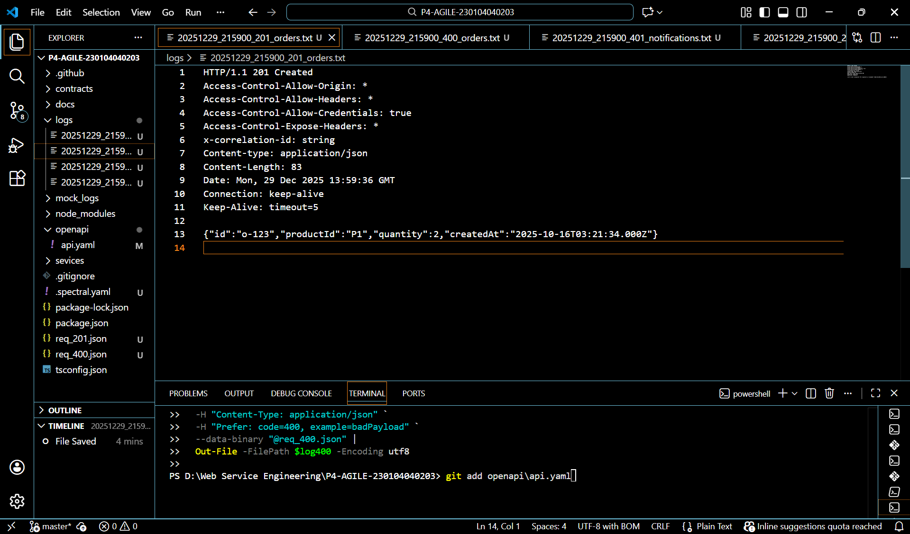
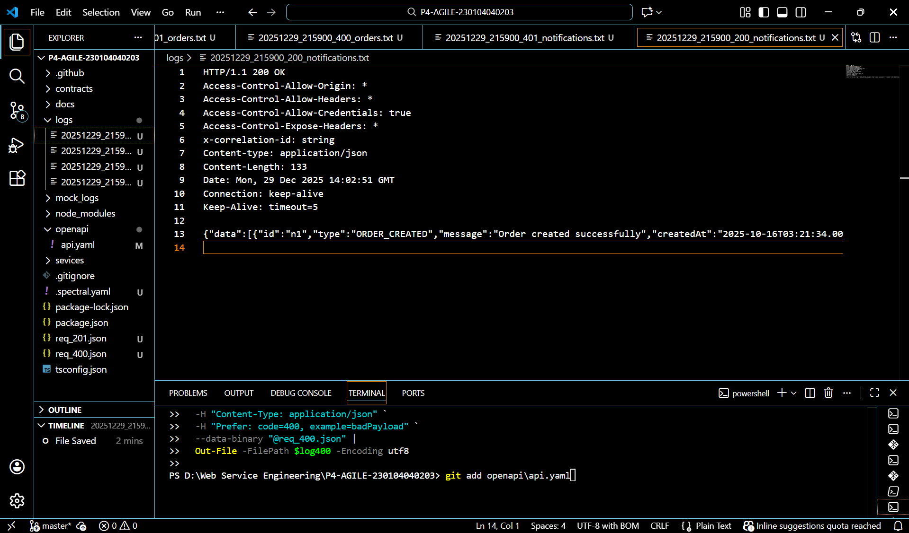
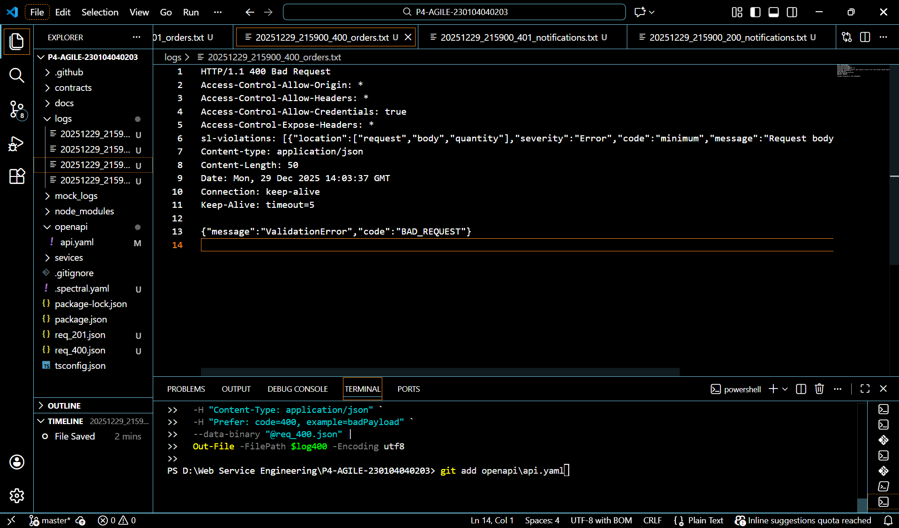
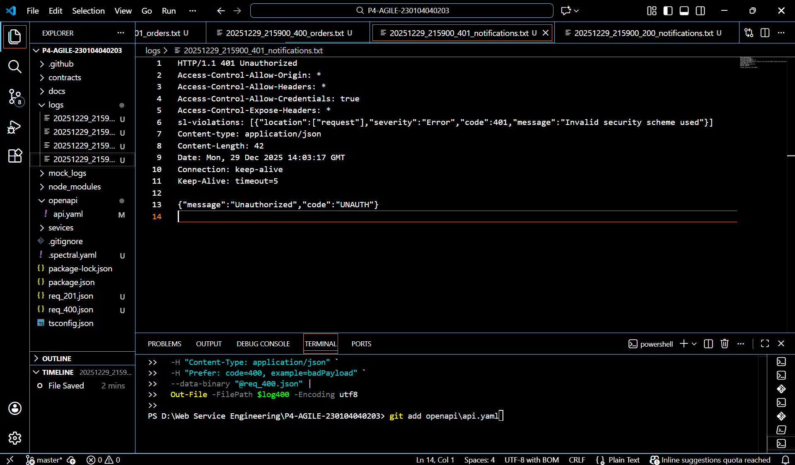

# Praktikum 4 – Web Service Engineering (AGILE)

Mini E-Commerce API  
**Design-First → Mock-First → Test-First → Implementasi (GREEN) → CI → Hardening**

## 👤 Identitas
- Nama        : **Nor Hayati**
- NIM         : **230104040203**
- Kelas       : **TI23A**
- Mata Kuliah : **Web Service Engineering**

---

## 📌 Deskripsi
Repository ini merupakan hasil **Praktikum 4 Web Service Engineering** yang menerapkan metodologi **Agile** dan **Contract-Based API Development**.

Pengembangan dilakukan dengan alur:
1. Design-First menggunakan **OpenAPI**
2. Mock-First menggunakan **Prism**
3. Test-First (RED → GREEN) menggunakan **Jest & Supertest**
4. Implementasi service menggunakan **Express + TypeScript**
5. Continuous Integration (CI)
6. Hardening (Security & Observability)

---

## 🛠 Teknologi yang Digunakan
- Node.js 18+
- TypeScript
- Express
- OpenAPI 3.0
- Spectral (OpenAPI Linter)
- Prism (Mock Server)
- Jest & Supertest
- Zod (Request Validation)
- Pino (Logging)
- Helmet
- express-rate-limit
- GitHub Actions (CI)

---

## 📂 Struktur Proyek
````bash
P4-AGILE-230104040203/
│
├── .github/workflows/
│ └── ci.yml
│
├── contracts/
│ └── api.yaml
│
├── docs/
│
├── hasiluji/
│ ├── 200.png
│ ├── 201.png
│ ├── 400.png
│ └── 401.png
│
├── logs/
│
├── mock_logs/
│
├── openapi/
│ └── api.yaml
│
├── services/
│ ├── order-service/
│ │ ├── src/
│ │ │ └── index.ts
│ │ └── test/
│ │ └── order.spec.ts
│ │
│ └── notification-service/
│ ├── src/
│ │ └── index.ts
│ └── test/
│ └── notification.spec.ts
│
├── utils.ts
├── jest.config.cjs
├── tsconfig.json
├── .spectral.yaml
├── package.json
├── package-lock.json
└── README.md
````

---

## 🚀 Cara Menjalankan Proyek

### 1️⃣ Install Dependency
```bash
npm install
```
### 2️⃣ Lint OpenAPI (Design-First)
```bash
npm run lint:api
✅ Hasil: 0 error, 0 warning
```
### 3️⃣ Mock Server (Mock-First)
```bash
npm run mock
````
Mock server berjalan di:
```bash
http://127.0.0.1:4010
```
Bukti hasil mock tersimpan di:
```bash
mock_logs/
```
### 4️⃣ Jalankan Test Otomatis (Test-First)
```bash
npm test
```
✅ Semua test HIJAU (GREEN)
### 5️⃣ Menjalankan Service (Runtime)
Order Service
```bash
npm run dev:orders
```
URL:
```bash
http://localhost:5002
```
Notification Service
```bash
npm run dev:notif
```
URL:
```bash
http://localhost:5003
```

---

### 🔐 Autentikasi

Semua endpoint menggunakan Bearer Token (dummy):

Authorization: Bearer test123

📡 Endpoint API
➕ POST /orders

Request Body
```bash
{
  "productId": "P001",
  "quantity": 1
}
```
Response
```bash
201 Created

400 Bad Request

401 Unauthorized
```

---

### 📥 GET /notifications

Query Parameter
```bash
?limit=10
```
Response
```bash
200 OK
401 Unauthorized
```

---

### 🔍 Hasil Pengujian

Seluruh skenario pengujian berhasil dijalankan dan dibuktikan dengan screenshot.
### 📸 Bukti Hasil Uji

**201 Created**


**200 OK**


**400 Bad Request**


**401 Unauthorized**

 
 ---

### 🛡 Hardening & Security

Fitur hardening yang diterapkan:

Logging terstruktur (JSON) menggunakan Pino

x-correlation-id pada setiap request

Rate limiting untuk mencegah abuse

Security headers (Helmet)

Validasi request dengan Zod

Invalid JSON ditangani dengan 400 BAD_JSON

Error response tanpa stack trace

## Bukti runtime disimpan pada:
```bash
logs/
```

### 🤖 Continuous Integration (CI)

CI dijalankan menggunakan GitHub Actions dengan tahapan:

Lint OpenAPI (Spectral)

Unit Test (Jest)

File workflow:
```bash
.github/workflows/ci.yml
```

### 📄 Artefak Praktikum

Kontrak OpenAPI (openapi/api.yaml)

Mock logs (mock_logs/)

Hasil pengujian (hasiluji/)

Runtime logs (logs/)

CI workflow

Dokumentasi (README)

### Kesimpulan
Pada Praktikum 4 mata kuliah Web Service Engineer, telah berhasil dikembangkan Mini E-Commerce API dengan menerapkan metodologi Agile dan pendekatan Design-First, Mock-First, serta Test-First. Proses pengembangan dimulai dari perancangan kontrak API menggunakan OpenAPI, dilanjutkan dengan pembuatan mock server menggunakan Prism untuk memvalidasi skenario respons, kemudian penulisan pengujian otomatis sebelum implementasi layanan dilakukan.

Implementasi web service berhasil memenuhi seluruh kontrak dan pengujian yang telah didefinisikan, dibuktikan dengan seluruh test yang berjalan berhasil (GREEN). Selain itu, penerapan Continuous Integration (CI) memastikan setiap perubahan kode tervalidasi secara otomatis melalui proses linting dan pengujian.

Dari sisi kualitas layanan, fitur hardening seperti autentikasi, validasi input, logging terstruktur, correlation-id, rate limiting, serta penanganan error yang aman telah diterapkan dengan baik. Hal ini membuat layanan menjadi lebih aman, andal, dan mudah ditelusuri. Dengan demikian, tujuan praktikum untuk memahami pengembangan web service berbasis kontrak dan praktik standar industri dapat tercapai dengan baik.